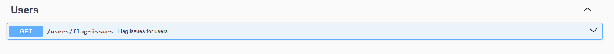

# Тестовое задание для Effective Mobile

## 1. Задание

### Схема базы данных


penis
### Первый сервис (Продукты и остатки)

#### Endpoints

Swagger документация доступна после развертывания по ссылке:

- [Продукты и остатки - Swagger](http://localhost:3002/api-docs/)


### Второй сервис (История)

#### Endpoints

Swagger документация доступна после развертывания по ссылке:

- [История - Swagger](http://localhost:3001/api-docs/)


### Общая сводка

#### Стек технологий

Для обоих сервисов использован следующий стек:

- **JavaScript**
- **Express**
- **RabbitMQ**

## 2. Задание

### Стек технологий

- **TypeScript**
- **NestJS**
- **TypeORM**

#### Endpoints

Swagger документация доступна после развертывания по ссылке:

- [Пользователи - Swagger](http://localhost:3000/api-docs/)



## Развертывание

### Для запуска всех сервисов

Я использовал **Docker** для контейнеризации всех сервисов, включая RabbitMQ и PostgreSQL. Все переменные окружения уже настроены в `.env` файлах для каждого сервиса.

1. В корневой директории выполните команду:

   ```bash
   docker-compose up --build
   ```

### Важное

При развертывании автоматически запускаются миграции. Во втором сервисе миллион человек, поэтому придется подождать.

### Важные ссылки:

- **Сервис продуктов и остатков** (Swagger): [http://localhost:3002/api-docs/](http://localhost:3002/api-docs/)
- **Сервис с историей** (Swagger): [http://localhost:3001/api-docs/](http://localhost:3001/api-docs/)
- **Сервис с пользователями** (Swagger): [http://localhost:3000/api-docs/](http://localhost:3000/api-docs/)

### Админка RabbitMQ:

- Админка RabbitMQ доступна по ссылке: [http://localhost:15672/](http://localhost:15672/)

  **Логин**: admin  
  **Пароль**: admin
